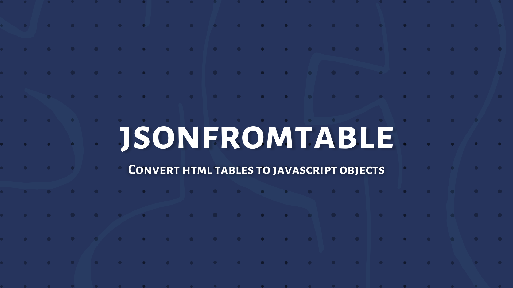

<p align="center">
  Convert html tables to object (or array). Supports complex rowspan and colspan.
</p>

<p align="center">
  <a href="https://www.npmjs.com/package/jsonfromtable"></a>
  <a href="https://github.com/coderosh/jsonfromtable"></a>
  <a href="#"></a>
  <a href="https://github.com/coderosh/jsonfromtalbe"></a>
  <a href="https://github.com/coderosh/jsonfromtalbe"></a>
</p>

## Installation

Install via npm

```sh
npm install jsonfromtable
```

Or via yarn

```sh
yarn add jsonfromtable
```

## Usage

### From html string

- Get array of objects with title as keys

  ```js
  const { JSONFromTable } = require('jsonfromtable')

  const obj = JSONFromTable.fromString(`<html>...</html>`)
  console.log(obj)
  /*
  [
    {
      title: value1,
      title2: value2,
      ...
    },
    ...
  ]
  */
  ```

- Get array of title and body

  ```js
  const { JSONFromTable } = require('jsonfromtable')

  const { headers, body } = JSONFromTable.arrayFromString(`<html>...</html>`)
  console.log(headers) // [title1, title2, title3, ...]
  console.log(body) // [ [val1, val2, ...], [val3, val4, ...], ... ]
  ```

### From url

```js
const { JSONFromTable } = require('jsonfromtable')

async function main() {
  const obj = await JSONFromTable.fromUrl(`https://...`)
  console.log(obj)

  const { headers, body } = await JSONFromTable.arrayFromUrl(`https://...`)
  console.log(headers)
  console.log(body)
}

main()
```

<br />

Each function in `JSONFromTable` accepts two arguments. First is source (html string or url) and second is `options`.

```ts
interface Options {
  titles?: string[] // custom titles (eg: ["sn", "name", "title"])
  firstRowIsHeading?: boolean // use first row for titles ?
  includeFirstRowInBody?: boolean // add first row in body ?
  tableSelector?: string // css selector for table (eg: table.wikitable)
  rowColSelector?: [string, string] // css selectors for row and col (eg: ["tr", "th,td"])
  shouldBeText?: boolean // if false value is html else true
  trim?: boolean // should trim the value ?
}
```

## Example

```js
const str = `<table>
  <tr>
    <th>name</th>
    <th>alias</th>
    <th>class</th>
    <th>info</th>
  </tr>
  <tr>
    <td colspan="2">Roshan</td>
    <td>Eng</td>
    <td rowspan="2">na</td>
  </tr>
  <tr>
    <td rowspan="2">John</td>
    <td colspan="2">Cook</td>
  </tr>
  <tr>
    <td rowspan="2">Danger</td>
    <td colspan="2"> Ninja</td>
  </tr>
  <tr>
    <td>AGuy</td>
    <td>Eng</td>
    <td rowspan="2">Eats a lot </td>
  </tr>
  <tr>
    <td colspan="2"> Dante</td>
    <td rowspan="2">Art</td>
  </tr>
  <tr>
    <td>Jake</td>
    <td>ake</td>
    <td>Actor</td>
  </tr>
</table>`

const obj = JSONFromTable.fromString(str, {
  tableSelector: 'table',
  trim: true,
})

console.log(obj)
```


## License

MIT
